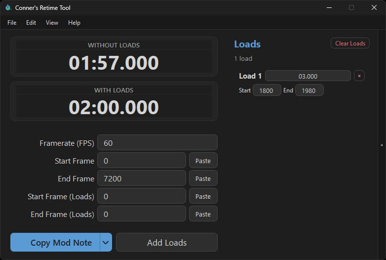

<div align="center">
  

  # Conner's Retime Tool

  <b>A desktop app for speedrunners and moderators to time runs accurately — with or without loads.</b>

  <p>
    <a href="https://github.com/connerglover/crt/releases/latest"></a>
    <a href="https://github.com/connerglover/crt/actions/workflows/build.yml"></a>
    <a href="https://github.com/connerglover/crt/releases"></a>
    <a href="LICENSE"></a>
    
  </p>

  
</div>

## ✨ Features

- Time a run by frame, or by pasting a timestamp / YouTube debug string
- Track individual loads with automatic totals, with and without loads
- Customizable mod note format ([available placeholders](Mod%20Note%20Format.MD))
- Fully customizable hotkeys for every action
- Session history — save, reload, and revisit past runs
- Always-on-top mode and automatic update checks
- English, Français, Polski, and Español

## 📦 Installation

Grab the latest build for your platform from [Releases](https://github.com/connerglover/crt/releases/latest) and run it.

## 🐍 Running from Source

Requires Python 3.10+.

```bash
pip install -r requirements.txt
python src/main.py
```

## 🔨 Building the Executable

Windows, macOS, and Linux binaries are built automatically by the [build workflow](.github/workflows/build.yml) and attached to a GitHub Release whenever a version tag (e.g. `1.2.2`) is pushed. To build locally:

<details>
<summary><b>🪟 Windows</b></summary>

```bash
pip install -r requirements.txt pyinstaller
cd src
pyinstaller --onefile --windowed --icon=icon.ico --add-data "icon.ico;." --name crt main.py
```

Output: `src/dist/crt.exe`

</details>

<details>
<summary><b>🍎 macOS</b></summary>

```bash
pip install -r requirements.txt pyinstaller pillow
cd src
python - <<'PY'
import os
from PIL import Image

im = Image.open("icon.ico").convert("RGBA")
os.makedirs("crt.iconset", exist_ok=True)
for size in (16, 32, 128, 256, 512):
    im.resize((size, size), Image.LANCZOS).save(f"crt.iconset/icon_{size}x{size}.png")
    im.resize((size * 2, size * 2), Image.LANCZOS).save(f"crt.iconset/icon_{size}x{size}@2x.png")
PY
iconutil -c icns crt.iconset -o icon.icns
pyinstaller --onefile --windowed --icon=icon.icns --add-data "icon.ico:." --name crt main.py
hdiutil create -volname CRT -srcfolder dist/crt.app -ov -format UDZO ../crt-macos.dmg
```

Output: `src/dist/crt.app`, packaged as `crt-macos.dmg`

</details>

<details>
<summary><b>🐧 Linux</b></summary>

```bash
pip install -r requirements.txt pyinstaller
cd src
pyinstaller --onefile --name crt main.py
```

Output: `src/dist/crt` (the [build workflow](.github/workflows/build.yml) additionally packages this as an AppImage)

</details>

## 🤝 Contributing

Bug reports, feature requests, and pull requests are welcome — see [CONTRIBUTING.md](CONTRIBUTING.md). Please also read our [Code of Conduct](CODE_OF_CONDUCT.md); project decisions are explained in [GOVERNANCE.md](GOVERNANCE.md). Found a security issue? See [SECURITY.md](SECURITY.md) instead of opening a public issue.

## 🙌 Credits

- Menzo — French & Polish translation
- Cris — Spanish translation

## 📄 License

CRT is licensed under the [MIT License](LICENSE).