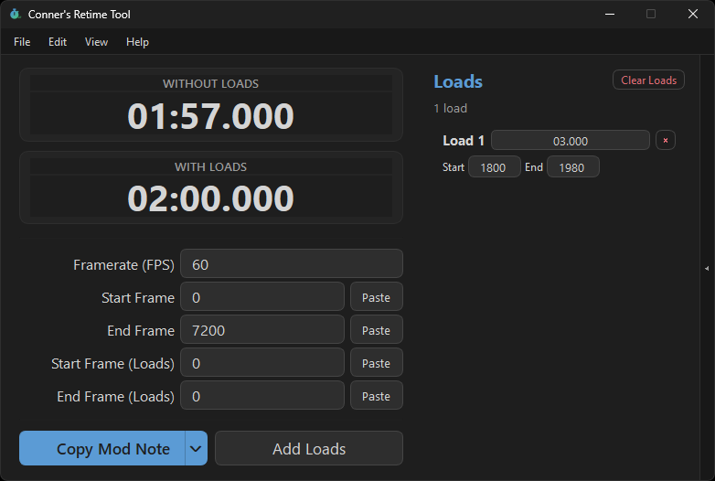

<div align="center">
  

  # Conner's Retime Tool

  <b>A desktop app for speedrunners and moderators to time runs accurately — with or without loads.</b>

  <p>
    <a href="https://github.com/connerglover/crt/releases/latest"></a>
    <a href="https://github.com/connerglover/crt/actions/workflows/build.yml"></a>
    <a href="https://github.com/connerglover/crt/releases"></a>
    <a href="LICENSE"></a>
    
  </p>

  
</div>

## 📦 Three implementations

CRT ships as a native app on Windows and macOS, with the original cross-platform
Python build still covering Linux. All three read and write the same run files
and the same `settings.ini`, so you can move between them freely.

| | Source | Stack | Status |
|---|---|---|---|
| 🪟 **Windows** | [`src-windows/`](src-windows/) | C# · .NET 8 · WinUI 3 | Native rewrite |
| 🍎 **macOS** | [`src-macos/`](src-macos/) | Swift 5.9 · SwiftUI | Native rewrite |
| 🐧 **Linux** | [`src/`](src/) | Python · PySide6 | Original |

The native rewrites are built to a shared specification —
[`docs/native-rewrite-spec.md`](docs/native-rewrite-spec.md) — which is the
source of truth for behavior on both platforms.

## ✨ Features

**Retiming**

- Time a run by frame, or by pasting a timestamp / YouTube debug string
- **Load mode** — start of run, end of run, and individual loads subtracted, with
  automatic totals both with and without loads
- **Segment mode** — mark any number of segments and total them, with the full-run
  span tracked alongside
- Automatic YouTube framerate detection, so a pasted debug string can't be
  silently converted at the wrong FPS
- Inline-editable load/segment sidebar with per-entry durations

**Video retimer** *(native apps)*

- Import a YouTube URL, a direct video URL, or a local video file
- Frame-by-frame navigation with `<` / `>`, play/pause, and jump controls
- Mark segment or load boundaries with a button or a hotkey, straight from playback
- Export the retimed video with a LiveSplit-style timer burned into the corner —
  the clock runs during gameplay, freezes through loads, and holds the final time

**Dashboard** *(native apps)*

- A run library of everything you've timed, with times, mode, and quick actions
- Speedrun.com integration — sign in with your API key
- **Runs to Verify** — every pending run across the games you moderate, with
  watch, retime, verify, and reject without leaving the app

**Everything else**

- Customizable mod note format ([available placeholders](Mod%20Note%20Format.MD))
- Copy as a mod note, a Discord message, or a YouTube chapter list
- Fully customizable hotkeys for every action
- Session history and a persistent recent-files list
- Undo/redo, autosave, and crash recovery
- Always-on-top mode and automatic update checks
- English, Français, Polski, and Español

## 📥 Installation

Grab the latest build for your platform from
[Releases](https://github.com/connerglover/crt/releases/latest) and run it.

## 🔨 Building from source

<details>
<summary><b>🪟 Windows — C# / WinUI 3</b></summary>

Requires the [.NET 8 SDK](https://dotnet.microsoft.com/download). No Visual
Studio needed.

```bash
dotnet build src-windows/CRT.sln
dotnet test  src-windows/CRT.Core.Tests/CRT.Core.Tests.csproj
dotnet run --project src-windows/CRT/CRT.csproj
```

See [`src-windows/README.md`](src-windows/README.md) for details.

</details>

<details>
<summary><b>🍎 macOS — Swift / SwiftUI</b></summary>

Requires macOS 14+ and Swift 5.9 (Xcode 15+).

```bash
cd src-macos
swift build
swift test
make app       # bundles build/CRT.app
```

Or open `src-macos/Package.swift` directly in Xcode. See
[`src-macos/README.md`](src-macos/README.md) for details.

</details>

<details>
<summary><b>🐧 Linux — Python</b></summary>

Requires Python 3.10+.

```bash
pip install -r requirements.txt
python src/main.py
```

To build a binary:

```bash
pip install -r requirements.txt pyinstaller
cd src
pyinstaller --onefile --name crt main.py
```

Output: `src/dist/crt` (the [build workflow](.github/workflows/build.yml)
additionally packages this as an AppImage).

</details>

## 🎬 Video features

The video retimer and YouTube import rely on **ffmpeg** and **yt-dlp**. The
native apps look for them on your `PATH` first and offer to download them on
demand if they're missing — nothing to install up front.

## 🤝 Contributing

Bug reports, feature requests, and pull requests are welcome — see [CONTRIBUTING.md](CONTRIBUTING.md). Please also read our [Code of Conduct](CODE_OF_CONDUCT.md); project decisions are explained in [GOVERNANCE.md](GOVERNANCE.md). Found a security issue? See [SECURITY.md](SECURITY.md) instead of opening a public issue.

## 🙌 Credits

- Menzo — French & Polish translation
- Cris — Spanish translation

## 📄 License

CRT is licensed under the [MIT License](LICENSE).
